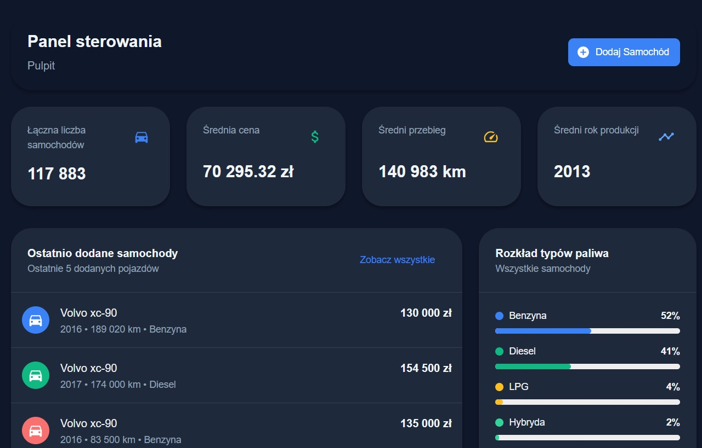
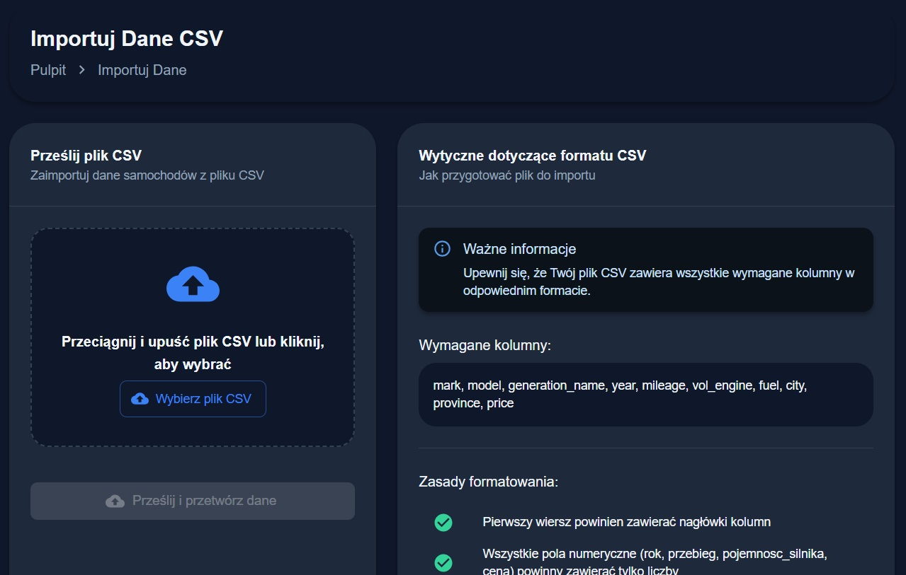

# Docker Project: Cars Delivered in Poland (2022)

This project summarizes data on cars bought in Poland in 2022. It features a full-stack architecture with a JavaScript frontend and a Python (Django) backend, containerized with Docker and orchestrated using Docker Compose. The stack also includes integrated monitoring and analytics via Grafana and Prometheus.

## Project Structure

- **Frontend:** React application (`JavaScript`)
- **Backend API:** Django REST API (`Python`)
- **Monitoring & Analytics:** Grafana, Prometheus
- **Containerization:** Docker, Docker Compose

---

## Local Development URLs

- **Frontend:** [http://localhost:3000](http://localhost:3000)
- **Backend API:** [http://localhost:8000/api/](http://localhost:8000/api/)
- **Django Admin:** [http://localhost:8000/admin/](http://localhost:8000/admin/)
- **Grafana:** [http://localhost:3001](http://localhost:3001)  
  _Login: `admin` | Password: `admin`_
- **Prometheus:** [http://localhost:9090](http://localhost:9090)

---

## Getting Started

### 1. Build and Start the Stack

Make sure you have [Docker](https://docs.docker.com/get-docker/) and [Docker Compose](https://docs.docker.com/compose/) installed.

Start all services using Docker Compose:

```bash
docker-compose up --build
```

### 2. Database Migrations

Run the following command to apply Django database migrations:

```bash
docker-compose exec backend python manage.py migrate
```

### 3. Create Django Admin User

To set up a superuser for the Django admin panel, run:

```bash
docker-compose exec backend python manage.py createsuperuser
```

Then follow the interactive prompts to create the admin account.

---

## Project Screenshots

Below are example images from the frontend. These are located in `frontend/public/images`:




---

## Technologies Used

- **Frontend:** React, JavaScript
- **Backend:** Django, Django REST Framework, Python
- **Database:** (Specify your database, e.g., PostgreSQL/MySQL/SQLite if relevant)
- **Monitoring:** Grafana, Prometheus
- **Containerization:** Docker, Docker Compose

---

## License

MIT License  
See [LICENSE](LICENSE) for more information.
